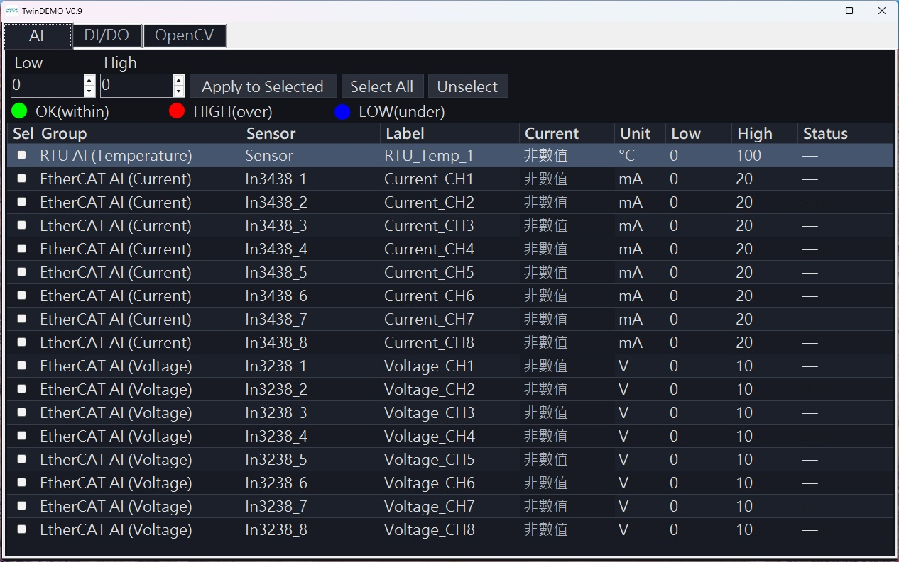
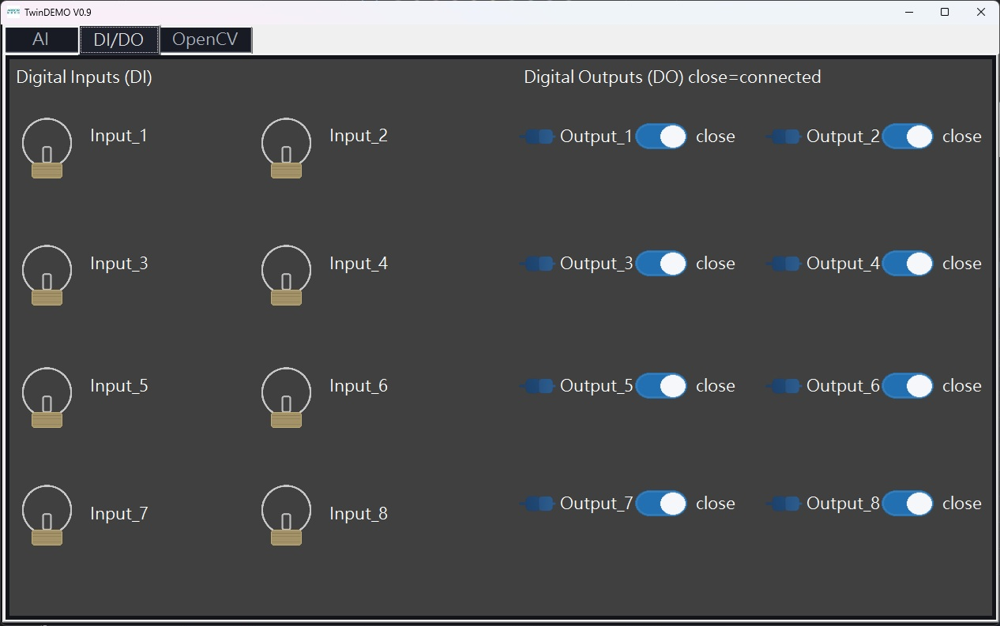
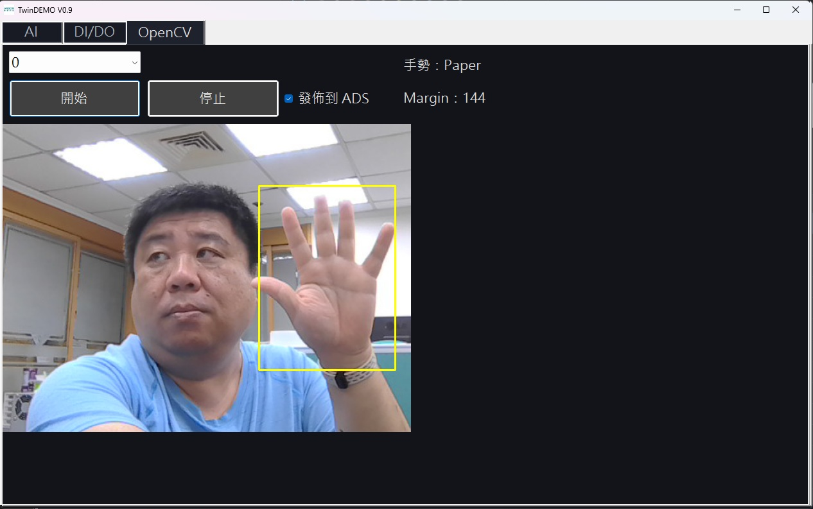
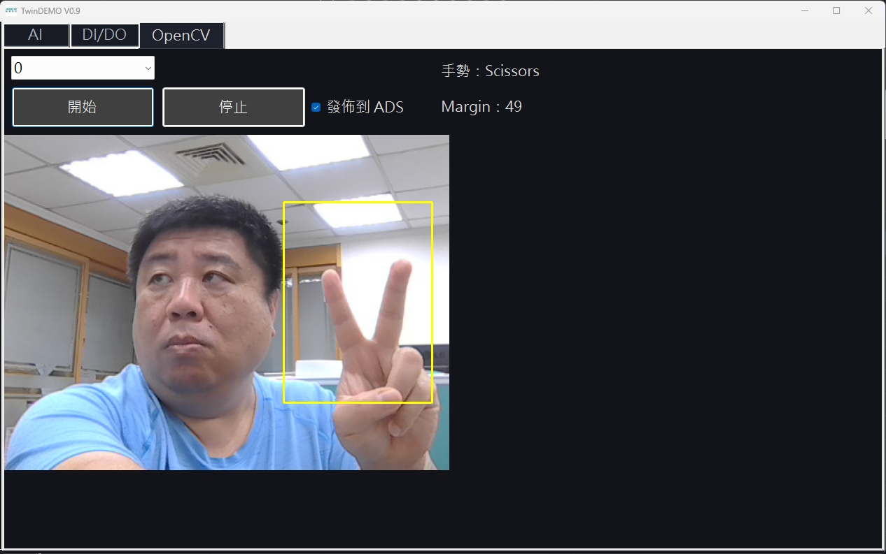

> **上圖頁面功能說明（AI 分頁）**：此頁面用於即時監看 17 路類比量測值（RTU 溫度 1 路 + EtherCAT 電流 8 路 + EtherCAT 電壓 8 路），並可批次或逐筆調整 `Low/High` 閾值；`Current` 欄位會依據 `Status`（`OK`/`HIGH`/`LOW`）顯示顏色，協助快速判讀異常。

# TwinCATDemo


## 介面截圖與頁面功能

### AI 分頁（總覽）


- 圖中實際狀態：目前 `Current` 欄位皆為「非數值」，`Status` 為空白（`—`），代表此截圖當下尚未讀到有效 AI 數值。
- 畫面可見功能：上方可用 `Low` / `High` 欄位搭配 `Apply to Selected` 批次設定門檻，並用 `Select All`、`Unselect` 控制勾選列。
- 資料列配置：`RTU AI (Temperature)` 1 筆、`EtherCAT AI (Current)` 8 筆、`EtherCAT AI (Voltage)` 8 筆，共 17 筆，與畫面一致。

### DI/DO 分頁


- 圖中實際狀態：左側 `Input_1..Input_8` 皆為灰色鎖頭圖示（未觸發），右側 `Output_1..Output_8` 文字皆顯示 `close`。
- 畫面可見功能：右側每一路 `Output` 都有一組連線圖示 + switch，可直接點擊切換 DO；標題 `Digital Outputs (DO) close=connected` 也明確標示 `close` 的語意。
- 同步邏輯：此頁面設計為由 ADS 週期輪詢同步 DI/DO 狀態，畫面與 PLC 值保持一致。

### OpenCV 分頁（`Paper` 辨識示例）


- 圖中實際狀態：Camera Index = `0`，`發佈到 ADS` 已勾選，手勢顯示 `Paper`，`Margin : 144`。
- 畫面可見功能：黃色 ROI 框位於右側，手掌完整張開且落在 ROI 內；可用 `開始` / `停止` 控制擷取流程。

### OpenCV 分頁（`Scissors` 辨識示例）


- 圖中實際狀態：手勢顯示 `Scissors`，`Margin : 49`，`發佈到 ADS` 同樣為勾選狀態。
- 畫面可見功能：使用者比出兩指手勢，目標位於黃色 ROI 內，右側文字即時顯示分類結果與 Margin。

### OpenCV 分頁（`Rock` 辨識示例）


- 圖中實際狀態：手勢顯示 `Rock`，`Margin : 46`，`發佈到 ADS` 為勾選狀態。
- 畫面可見功能：使用者握拳位於 ROI 內，系統即時回傳 `Rock`；此畫面與前兩張共同展示三種手勢辨識輸出。

---
`TwinCATDemo` 是一個以 `WinForms (.NET 8)` 開發的工控示範程式，整合：

1. **AI（Analog Input）監測**：透過 ADS 讀取 PLC 類比變數，顯示狀態並支援閾值管理。
2. **DI/DO 控制**：顯示 8 路 DI 狀態，並可切換 8 路 DO 開關，與 PLC 值雙向同步。
3. **OpenCV 手勢辨識**：以攝影機影像辨識 `paper/rock/scissors`，可將結果發佈至 PLC 變數。

---

## 1. 程式功能總覽

### 1.1 AI 分頁（`tab_AI`）
- 建立 17 筆量測列：
  - `RTU_Temp_1`
  - `In3438_1..8`（Current）
  - `In3238_1..8`（Voltage）
- 透過 `System.Windows.Forms.Timer`（200ms）輪詢 ADS 讀值。
- 狀態判斷規則：
  - `< Low` → `LOW`
  - `> High` → `HIGH`
  - 其餘 → `OK`
- 支援：
  - `Select All` / `Unselect`
  - 以 `numLow/numHigh` 批次套用到勾選列（`Apply to Selected`）

### 1.2 DI/DO 分頁（`tab_DIDO`）
- DI：讀取 `Input_1..8`，顯示 `di_on/di_off` 圖示。
- DO：讀取/寫入 `Output_1..8`，點擊 `doSwitch` 切換 `open/close`。
- UI 與 PLC 同步：輪詢時若 PLC 值有變動，畫面會自動更新對應圖示與文字。

### 1.3 OpenCV 分頁（`tab_OpenCV`）
- 選擇 Camera Index（預設 0~4）。
- 按下 `開始` 啟動擷取迴圈，`停止` 結束。
- 針對畫面右側固定 ROI 做手部特徵分析：
  - 色彩空間分割（`BGR -> YCrCb`）
  - 形態學去噪
  - 輪廓 / 凸包 / 缺陷特徵
  - 依評分推論 `Paper / Rock / Scissors`
- 穩定化機制：需滿足分數差與持續時間條件，才將穩定結果發佈到 ADS。

---

## 2. 系統架構

### 2.1 主要技術
- `net8.0-windows`
- `WinForms`
- `Beckhoff.TwinCAT.Ads`
- `OpenCvSharp4` + `OpenCvSharp4.Extensions` + `OpenCvSharp4.runtime.win`

### 2.2 核心檔案
- `Program.cs`：程式入口，啟動 `Form1`。
- `Form1.Designer.cs`：UI 控制項與三個分頁配置。
- `Form1.cs`：主要商業邏輯（AI、DI/DO、OpenCV、主題樣式）。
- `Form1.cs` 內 `AdsPublisher` 類別：封裝 ADS 連線、Handle 管理、讀寫與手勢發佈。
- `Properties/Resources.*`：UI 圖示資源（DI/DO 狀態、開關圖等）。

### 2.3 模組關係（簡化）
1. `Form1_Load`：
   - 建立 ADS 連線（`_ads.Connect("auto", 851)`）
   - 初始化 AI 與 DIDO 模組
   - 套用深色主題
2. AI/DIDO 模組透過各自 `Timer` 做週期性輪詢。
3. OpenCV 模組以背景 `Task` 擷取影像並更新 UI。
4. 所有 PLC 存取都由 `AdsPublisher` 統一管理。

---

## 3. 執行流程

### 3.1 啟動流程
1. 進入 `Main()`，啟動 `Form1`。
2. `Form1_Load` 初始化 Camera 清單、ADS 連線、AI/DIDO、UI Theme。
3. AI 與 DIDO 輪詢計時器開始工作。

### 3.2 AI 監測流程
1. 建立資料列與對應 ADS Handle。
2. 每 200ms 讀取一次 `float` 值。
3. 更新 `Current` 與 `Status`，並以色彩呈現結果。
4. 操作者可即時調整 `Low/High` 閾值。

### 3.3 DI/DO 流程
1. 建立 `Input_x / Output_x` Handles。
2. 每 200ms 讀取 DI/DO。
3. 點擊 DO 開關時寫入 PLC（`WriteBool`）。
4. UI 根據目前值更新 `open/close` 與連線圖示。

### 3.4 OpenCV 手勢流程
1. `btnStart_Click` 啟動 `CaptureLoop`。
2. 固定 ROI 後執行影像前處理與特徵抽取。
3. 計算三類分數，取得 `winner` 與 `margin`。
4. `ApplyStabilizationAndOutput` 檢查穩定條件。
5. 若 `chkADS` 啟用且結果穩定，發佈：
   - `GVL.gGesture`
   - `GVL.gMargin`
   - `GVL.gStable`

---

## 4. PLC 變數對應（預設）

### 4.1 OpenCV 發佈
- `GVL.gGesture`：0/1/2/3（none/paper/rock/scissors）
- `GVL.gMargin`：分數差
- `GVL.gStable`：是否穩定輸出

### 4.2 AI 讀值
- 前綴：`GVL.`（可於程式中改為 `MAIN.`）
- 變數：`Sensor`, `In3438_1..8`, `In3238_1..8`

### 4.3 DI/DO 讀寫
- DI：`GVL.Input_1..8`
- DO：`GVL.Output_1..8`

---

## 5. 建置與執行

```bash
dotnet restore
dotnet build
```

執行後可在三個分頁分別操作 AI / DI/DO / OpenCV 示範功能。

---

## 6. 注意事項
- 本專案為 Windows 桌面程式（`WinForms`），請於 Windows 環境建置與執行。
- 若 ADS 無法連線，AI/DI/DO 將無法取得 PLC 即時資料。
- OpenCV 手勢辨識與光線、背景、手部位置高度相關；建議固定鏡頭與 ROI 操作區。
